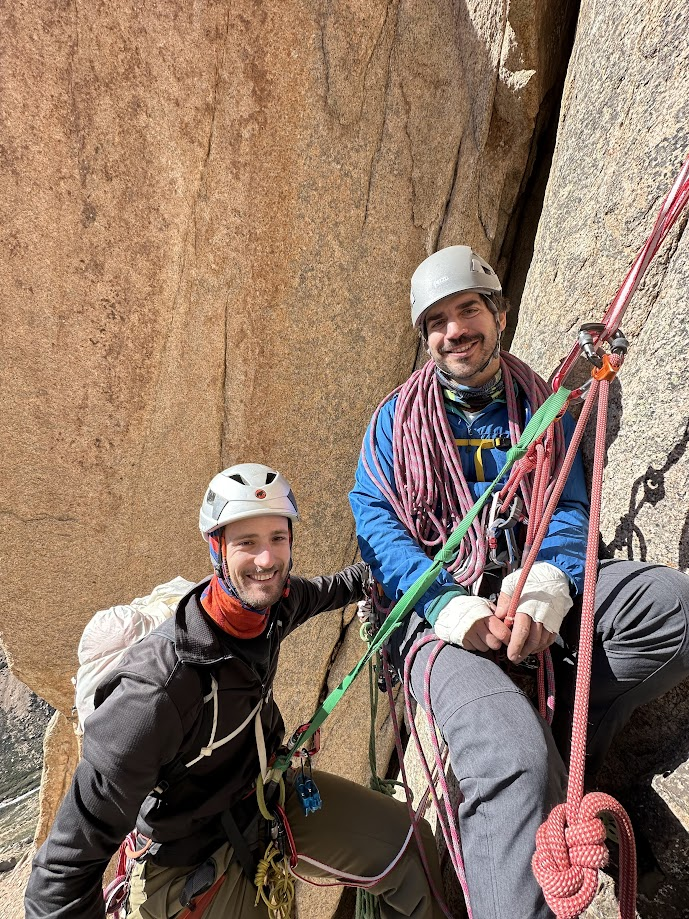

# Arenales

Bienvenidos, this post is intended to:
- Tell you about my first trad climbing trip as a "Leader".
- Get back to the community from which I've taken much and not given anything. This means trying to provide as much info as I can about the climbing routes I did with my good friends.
- Try to reference the good resources I've used to prepare myself for this trip.

Ah yes, this post ~~may be~~ is long, and it's a mixture of story telling and "technical climbing info", so skip to whichever part you like.

## Forewords
As stated on my homepage, this website can have posts either in Argentine Spanish or broken English. In this case, I've chosen the latter.

This is because, I am _really_ trying to get back to the worldwide community (how thoughtful Manu) and writting in English is probably the best way reaching the most amount of people. That being said, I am also writting in English because I simply want to (yes, you may call me _cipayo_).

It should be reminded, that I am, under no circumstances, a qualified climbing instructor and this should not be taken as a guide. This is simply the story of a gumby who was able to share a beautiful trip with his friends.

If you want to head right into the Climbing Info, just skip the Backstory or whatever you see fit. I am including plenty of pictures.

## Backstory
I started climbing on 2017 at one of those "ring the bell at the top" type of walls and it was more than enough to have me instantly hooked. From there, I started consistently climbing at the gym and at the occasional crag.

Soon after I started, I met one of my biggest climbing friends, Santi. Santi is also a mountain guide who, over the course of our climbing partnership, took me to several amazing climbing destinations, such as Sierra La Vigilancia, Capilla del Monte, Piedra Parada, and many more.

*Santi, Tortu and Me on the summit of Patricia on my second trip to Arenales.*

However, one of them stood out, Arenales, located at the Mendoza's Cordillera, a.k.a., the Andes. My first trip to this place had me realise I hadn't actually experienced the beauty of climbing yet. 

These trips had me in awe, not only because of the stunning views and quality of the climbing, but also because of the sheer determination and composure that Santi and other friends (Tortu) climbed with.

Having successfully lead two 6a trad pitches on one of those last trips, I learned two things: Trad climbing was indeed hard and required a mental strength that I doubted I could ever achieve on my own. But I also knew I wanted to lead and share the experience with other people.

Juancho and Edu are two of the most intelligent life forms I have met during my presence on this planet. Edu is essentially a real-life mad scientist (like the one from Flubber) and Juancho is a mystery box who never ceases to amaze me. I've met them while getting my bachelor's and
after discovering their interest towards climbing I immediately knew we had to make it to Arenales.

_Juancho and Edu posing for arguably one of their best pictures in Arenales._

This third trip to Arenales is the manifestation of the lessons learnt and the culmination of a gumby's personal growth. This is the story of how I became Edu's and Juancho's Santi.

## Getting There, Gear & Other Resources
I will try not to make this section too long since, A, I don't really remember much (it was a long process) and B there are a million other places where you can find better Trad Climbing resources.

Let me say, that the single most valuable piece of advice I can give you about Arenales is: **get the guide**. You can, _sometimes_, buy it on climbing stores in Argentina or (I don't frankly know exactly how) you can get a PDF from the writer Nacho Elorza. For the second alternative, your best shot is to contact him on his instagram @arenalesclimbing.

To support the guide, I will only share the topos  of the two multi-pitches we did on this last trip Arenales.

### Getting There & Supermarket Haul
On all of my previous visits, we drove from Buenos Aires, on a long - but not that long - 14 hour drive to Arenales itself. This is probably the best way of getting there since you have no weight limits and get to buy most of your goodies beforehand. Also, the last leg of the trip from Manzano Historico to the valley has no public transportation.

However, we wanted to maximize the amount of time at the valley (driving takes 2 days of your trip) and minimize the travel fatigue (I wanted any little edge I could get to lead this trip). So, we took a 2-hour flight from Buenos Aires to Mendoza, and then picked up rented a car at the airport (previously hired over the internet, which ended up being 3x more expensive than the listed price so, don't use rentalcars.com).

From the airport, we headed to the supermarket and got our goodies for the trip. Now, back home I can name who the MVP's of the haul turned out to be:
- Peanut butter & Oreos
- Salame and Hard Cheese
- Pan Dulce (Argentine Pannetonne)
- Pistachios

And the clear misses:
- A pound of mozzarella cheese
- Three pounds of assorted nuts, which were mostly consumed by the mice at the hut
- A box of Earl Grey tea bags
- More than 30 granola bars
- A huge potato

Back to the "getting there" part, we drove roughly two hours from Mendoza to Manzano Historico where we spent the night. 

Why not head up the Valley that same night?

Arenales is close the Argentine-Chilean border, so there is a military checkpoint that requires registration of anyone who wants to go up the mountains. This base operates from 8:00 AM to, as describe by one of the Gendarmes (Argentine Militar Forces), "prudent hours". I can confidently say that prudent hours are between 7 and 7:30 PM. 

**So basically you can only head up from 8 AM to 7:30 PM.**

### Gear
I will skip obvious personal gear such as helmet, abseiling device, etc. Collectively as a group we had:

- Double Ropes (thanks Santi)
- 2 sets of 0.5 to 3 Camalots (one from Black Diamond and one from Wild Country)
- 2 Blue Aliens and 2 Green Aliens
- 1 Set of Black Diamond Nuts
- 8 Alpine Draws
- 6 Quickdraws
- 3 120cm Dyneema Slings
- 1 240cm Dyneema Sling
- 7m long 7mm Cordelette
- 10m long 6mm cord
- As many locking carabiners as we had (about 12)
- 3 quick-links
- 1 Petzl Tibloc for self-rescue

In terms of clothing (this was December), what I used almost every single day was:
- Synthetic Hiking Pants
- Synthetic Long-Sleeved Baselayer
- Mid-layer from Target
- A baklava
- A puffy jacket
- Rain Jacket
- Big Puffy Jacket
- Camp Sandals (pair of Tevas)
- Sun Screen, lots of it (not clothing but putting it here feels right)

_Stuff I took Arenales this time, it did fit._

Again, this is just a guideline for anybody kind of wondering what to bring but, as you can obviously tell, it is not a very extensive description.

### Resources
I will try to list the most useful resources we used along the way to prepare for this trip.

#### Books
Besides trips with friends, I never had any formal Trad-specific climbing education, but I did read and used these which have proven to be more than enough for me.
1. Arenales Climbing Guide - Nacho Elorza [link](https://www.nakaoutdoors.com.ar/4140-guia-de-escalada-arenales). _There is one available at Arenale's Hut, so do not panic if you cannot buy it beforehand._
1. Trad Climbing Basics - VDiff Climbing [link](https://www.vdiffclimbing.com/shop/). _Great for starting out._ 
1. The Trad Climber's Guide To Problem Solving [link](https://www.vdiffclimbing.com/shop/). _Amazing illustrations for self-rescue._
1. DOWN - Andy Kirkpatrick [link](https://www.andy-kirkpatrick.com/shop/view/down). _All about descending (the scariest part for me), good for self-rescue and stuck ropes._

#### Links 
1. Alpine Savvy [Webpage](https://www.alpinesavvy.com/) and [Instagram](https://www.instagram.com/alpinesavvy/?hl=es). _This guy is just great, I mean there are a lot of things I could say about this person, but the most valuable trait about his posts, is that he really focuses on the "why" rather than just explaining the "how" about manuevers._
1. Alpine To The Max [Instagram](https://www.instagram.com/alpinetothemax/). _Another great resource, very similar to Alpine Savvy. His posts also focus on questioning the "that's how I learned it xD" mantra that frequently lives inside many climbers heads (including mine)._
1. VideoOracles Trad Climbing Day Overview [Article](https://rockclimb.videoracles.com/articles/climbing-days-overview/traditional-climbing-day-overview/). _Great for what to bring and expect, more on their videos before_.
1. Choss Climbers [Articles about Arenales](https://chossclimbers.com/testing/argentina-2/los-arenales/). _Not only great posts about their trip to Arenales, but also a source of inspiration for what you are reading right now!_

#### Videos
1. VideoOracles Trad Climbing Videos [Youtube Playlist](https://www.youtube.com/watch?v=PNmTwL_Yd4Y&list=PLeXpACI96ZApytqg4cVFnZ4TxiUGclADl&index=49). _These are just great, the instructor's voice is just mesmerizing._
1. Multi-Pitch Rapelling: Party of 3 [Youtube Short](https://www.youtube.com/shorts/HPkRsMk4T7A). _Great for faster abseiling as a party of three._
1. Learning to Trad Climb from DMM [Youtube Playlist](https://www.youtube.com/watch?v=lTe3LIMvYc0&list=PLJofyuybTSEzkENLWTA_D_hFa-g3B4dYR). _Also just a great series of videos._
1. Anchor Building - SIET [Youtube Video](https://www.youtube.com/watch?v=3Dx2w358rWY).
1. Keep It Simple Stupid - KISS - JB Mountain Skills [Youtube](https://youtu.be/IkL8o4qStI4). _Great video about building belaying setups._
1. Los Arenales - KTL Rock Trip [Youtube Video](https://www.youtube.com/watch?v=VuUY3vIJ_u0). _Great video about Arenales, thank you!_
1. Arenales A Tope Muro de Escalada Rock Trip [Youtube Video](https://www.youtube.com/watch?v=w1bGq1Wp7SQ). _Great video about Mujeres y Tequilas, showing the approach and good bit of the anchors._
